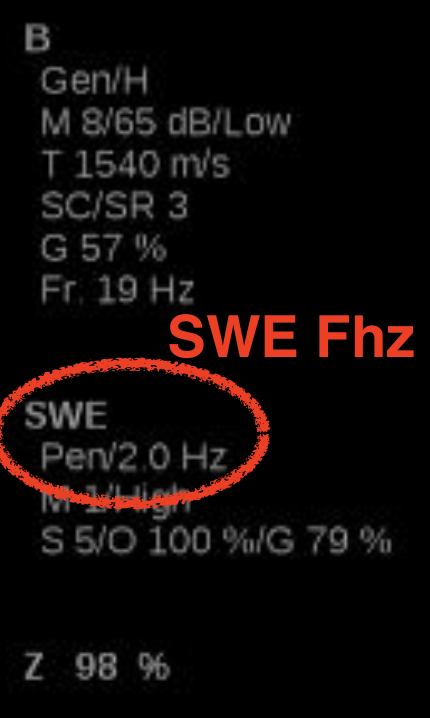
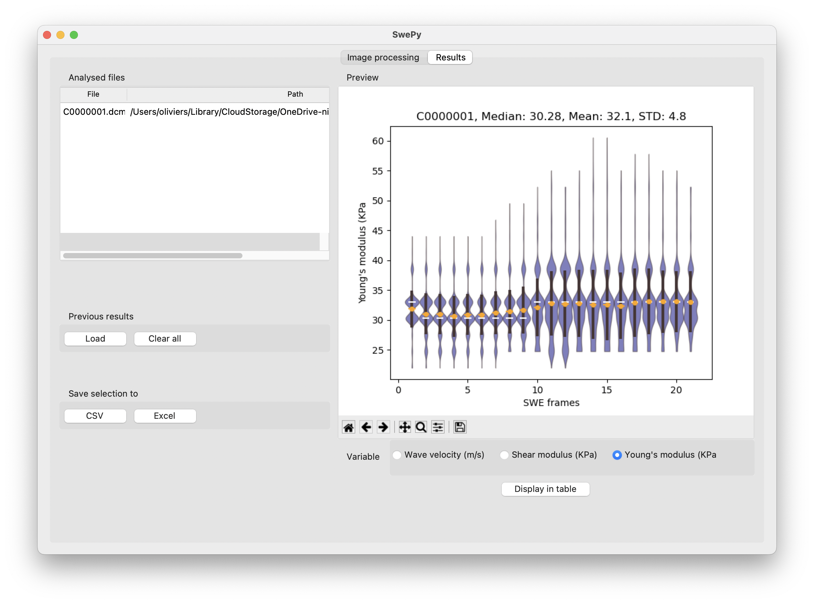

# swepy

A basic user interface to load and analyse shear wave elastography files recorded with **Hologic Supersonic** machines.

The script works with **dicom files** and is optimised for Mach30 machines but should work with other machines from the Mach range.
Scans from Aixplorer machines also seem to be compatible but have not yet been tested thoroughly.

The analysis currently consists in a graphical preview of the elastography measurements for each frame (violin plots), and calculations of mean and median values.
Results can be exported to a `csv` or `xlsx` file.

### Dependencies
The scripts run with Python 3.8. All package dependencies are listed in [requirements.txt](https://github.com/oseynnes/swepy/blob/0c40955e136abe7604a92e6e166fc4a2e2d29919/requirements.txt).

### Get started
- Clone this repository
- Install dependencies
- Run the `main.py` file to start the user interface
- Load a dicom file with an image sequence (video clip)
- Enter the following parameters found on the image frame:
	- acquisition frequency of SWE frames (`SWE fhz` parameter)
	- maximal scale value (`max. scale` parameter, in KPa or m/s)

|||
|---|---|

- (optional) Adjust ROI size (drag/drop on image)
- Press `Analyse`
- Find results preview and export interface in the `Results` tab.

